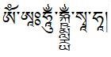

# Windows and Tibetan script

(fonts_windows)=
## Windows Tibetan fonts

Windows comes with a Tibetan font that has a very unusual property: it can render arbitrary complex Tibetan stacks (e.g. Sanskrit mantras) 'on the fly' without the requirement that a specific glyph is already part of the font. 

| Font name | Sample | Glyphs | Comment |
| --------- | :----: | ------ | ------- |
| Microsoft Himalaya |  | unlimited | Only font that can synthesize arbitrary stacks, works only on Windows |

Example:

Unusual stacks as in this Kālacakra mantra are no problem for Microsoft Himalaya.

For more fonts, see [Tibetan Fonts](tibetan_fonts.md).
## Tibetan keyboards for Windows

See [Windows Tibetan keyboards](computers_windows_keyboards.md)

