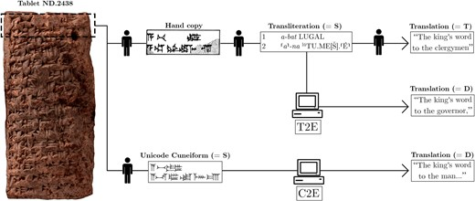

# Artificial intelligence (AI)

Recent progress in image recognition and especially in the field of large language models (LLMs)
and machine translation will change the way researchers can work with Tibetan source texts.

> **Note:** Research in application of AI on language translation is a very fast moving field. If you have new information that should be part of this collection, please generate an [issue at github](https://github.com/DigitalTibetan/DigitalTibetan/issues).

While for language systems that are commonly used, such as English or Chinese, these machine 
algorithms already achieve human level performance, so-called low-resource languages that are 
either no longer spoken by many people or are subject to other kind of restrictions on access 
of freely available material in that language, have not yet reached comparable level of functionality.

However, progress is being made: modern multi-language systems can even translate unknown languages
with very few given translation examples.

An example for a low-resource language where progress with machine translation has been made
is automatic translation of cuneiform texts from Akkadian to English:[^1]

 
_from: [Translating Akkadian to English with neural machine translation](https://academic.oup.com/pnasnexus/article/2/5/pgad096/7147349)_

Similar progress for Tibetan translation, including automatic scanning of old pecha woodblock texts is currently (May 2023) not yet on a level to be useful. However, significant progress is only a matter of time.

For more information on current status see: 

- [Tibetan optical character recognition (OCR)](tibetan_ocr.md)
- [Tibetan machine translation](tibetan_machine_translation.md)

## What the future will bring

Any day now some company could decide to make the investment to train a language model on classical Tibetan texts for translation and/or image recognition of old woodblock pechas. This will happen within in the few years with certainty.

At that point in time, the entire corpus of Tibetan texts that have been scanned and archived will suddenly be available:

- in computer readable text form
- through automatic translation, those texts will be available in many languages. Language models can be _fine tuned_ to take into account the context of different yānas, so automatic translation will be able to translates both Mahāyāna and Dzogchen text according their own specific language.

### Relation to current work

In essence, both the gigantic efforts to digitize all available dharma literature, and the ongoing translation project will server as the necessary training material to start of the process of fully automatic translation over the upcoming years.

Humans first will work togehter with language models to edit texts faster and more precise, and over the years, machine translation will continue more and more independently.

Very large translation projects, like 84000.co will most probably finished by automatic machine translation.

[^1]: Gai Gutherz and others, Translating Akkadian to English with neural machine translation, PNAS Nexus, Volume 2, Issue 5, May 2023, pgad096, <https://doi.org/10.1093/pnasnexus/pgad096>
