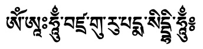
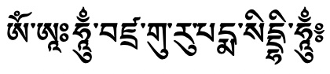
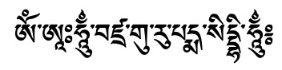
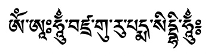
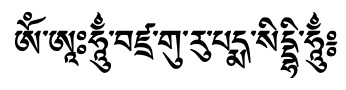
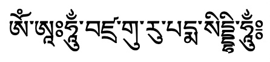
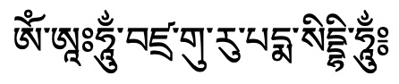

# Tibetan fonts

Tibetan fonts are difficult to produce due to the unlimited number of possible glyphs. While there are only a well defined set of 'standard' Tibetan syllables, there exists many extensions because of Sanskrit transliterations (e.g. mantras), Chinese transliterations, and Dzongkha shortcuts. Due to all of those extensions, it is virtually impossible to generate a 'complete' Tibetan font by providing all possible glyphs.

Microsoft had develop a system that could dynamically render new glyph variants, but the resulting Himalaya font doesn't work on non-Windows platforms and lacks the esthetics of preconceived glyphs. 

So Tibetan fonts either look artificial or are incomplete...

The following list contains a number of fonts with good coverage of the most common glyphs and open licenses.
## Overview of freely available Unicode Tibetan fonts

| Font name | Sample | Comment |
| --------- | :----: | ------- |
| [Tibetan Machine Uni](https://www.thlib.org/tools/scripts/wiki/tibetan%20machine%20uni.html) |  | One of the first Unicode fonts |
| [DDC Uchen](https://sites.google.com/view/chrisfynn/home/fonts/ddc-uchen) |  | Chris Fynn's font |
| [Jomolhari](https://sites.google.com/view/chrisfynn/home/fonts/jomolhari) |  | Chris Fynn's font |
| [Babelstone Tibetan](https://www.babelstone.co.uk/Fonts/Download/BabelStoneTibetan.ttf) |  | Extended version of Jomolhari |
| [Babelstone Tibetan Slim](https://www.babelstone.co.uk/Fonts/Download/BabelStoneTibetanSlim.ttf) |  | Extended version of Jomolhari, slim |
| [Noto Serif Tibetan](https://fonts.google.com/noto/specimen/Noto+Serif+Tibetan?noto.query=tibetan&noto.lang=bo_Tibt&noto.continent=Asia&noto.script=Tibt) |  | Google's Noto font, with many different weights |
| Noto Sans Tibetan |  | Based on or identical to Google's Serif Tibetan. |

## Remarks and History

[Chris Fynn](https://sites.google.com/view/chrisfynn/home) was one of the first Unicode font pioneers. His fonts Jomolhari and DDC Uchen, available with free Open SIL licenses, where the basis of many developments.

[The Babelstone Project](https://collab.its.virginia.edu/wiki/tibetan-script/Tibetan%20Fonts.html) by Andrew West has continued the work on Jomolhari and updated the font to newer Unicode standards and extended the glyph coverage.

[The Tibetan & Himalayan Library](https://www.thlib.org/tools/scripts/wiki/tibetan%20machine%20uni.html) at Virginia University had bought the rights on the proprietary Tibetan Machine font with help of the Trace Foundation and made it freely available as one of the first Unicode fonts.

[Google's Noto font family](https://fonts.google.com/noto/specimen/Noto+Serif+Tibetan) provides Tibetan support and free support for virtually every language on earth for a large number of platforms.

## External sources

- [Tibetan fonts at University of Virginia](https://collab.its.virginia.edu/wiki/tibetan-script/Tibetan%20Fonts.html)
