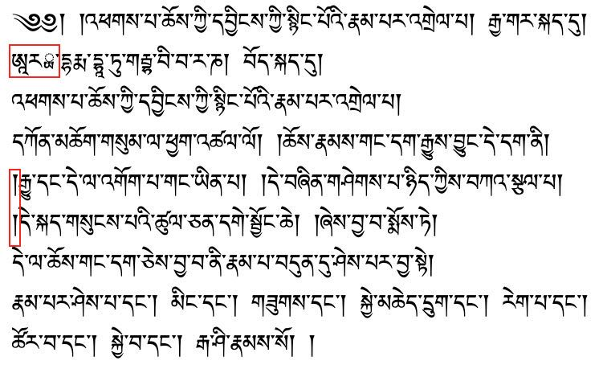
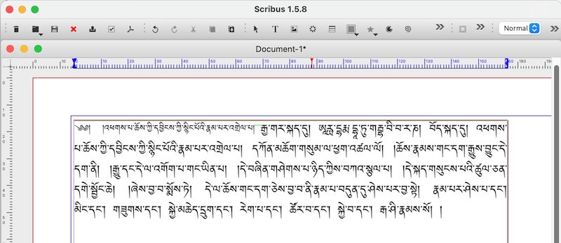
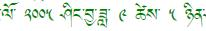
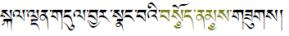
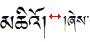

# Tibetan formatting rules
## Introduction

Current apps for desktop and mobile handle Tibetan script well, and in most cases it's simply necessary to use a correct [Tibetan font](tibetan_fonts.md) and things will work as expected.

The following describes the formatting process using the example of the following short Tibetan text.[^lh_naga] Pasting the text into some arbitrary editor might end up with something like:

[^lh_naga]: Start of a commentary by Nāgārjuna, from [Lotsawa House](https://www.lotsawahouse.org/bo/indian-masters/nagarjuna/essence-dharmadhatu)

Some problems are marked in red:
- there are two `shad` ། at a beginning of a line, which is forbidden,
- the Tibetan font wasn't able to render Ārya (ཨཱརྻ་) correctly.
Additionally,
- the font size of the header should be smaller

The following chapter shows how to enhance the formatting of our example.

This examples was typeset with [Scribus](https://www.scribus.net/), an excellent open-source type-setting program with good Tibetan support.

Notice:

- the headline-part is in smaller font (`yig chung`)
- smaller and larger fonts are aligned at the letter-head (see green line). This usually requires manual correction of the vertical position of either the smaller or larger Tibetan font, since most Tibetan fonts are optimized to mix well with Western text which aligns at the lower letter boundary.
- there are no `shad` ། at the line start.

## Basic formatting rules for Tibetan text

### Line-breaking rules

- Line breaks must not occur in the middle of a syllable. (Your app should take care of that already).
- Line breaks can appear after a syllable separator dot `tsheg` ་ (preferably but not mandatory: not in the middle of a Tibetan word). Exception: the sequence `nga <tsheg> <shad>` ང་། Here the `tsheg`  ་ is a so-called non-breaking `tsheg`.
- Additionally, line breaks are possible after _shad_ ། (but not in the middle of a sequence `། །`, here a line break can only occure after the last `shad` །), and after terma-sign `gter ma` ༔ and a `visarga` ཿ.

### Inter-syllable marker `tsheg` ་

- There is never a `tsheg`  ་ after a `visarga` ཿ. Example: `oṃ āḥ huṃ`, Wylie: `oM AHhU~M`, ཨོཾ་ཨཱཿཧཱུྃ་ — there is no `tsheg` ་ after `āḥ` ཨཱཿ.
- Unicode contains two codes for `tsheg`: 0x0F0B, the normal inter-syllable marker, and 0x0F0C a non-breaking variant. Usage of the second variant instructs the application not to line-break at this `tsheg`. (Similar to the non-breaking space 0xa0 for Western script.)

### White spaces

- Tibetan uses only _non-breaking spaces_ which should not vary in size on left-right justification.
- For this reason, justified text requires the application to vary the distance between letters of a syllable.

**Note:** To insert a _non-breaking space_, press `<Ctrl>-<Shift>-<Space>` (this works in LibreOffice or Microsoft Office). Most Tibetan keyboards also support `_` (underscore) as a short-cut for _non-breaking-space_.

### Usage of punctuation character `shad` །

- A line must not start with a `shad` །.
- A `shad` ། is used as a Tibetan inter-punctuation, similar but not identical to a comma.
- Verses, headlines or ends of longer paragraphs are ended by the sequence `<shad> <non-breaking space> <shad>` ། །.
- Exception: if the last letter of a line is either a `ka` ཀ or a `ga` ག, one `shad` ། is ommitted. This is also the case if `ka` ཀ or `ga` ག have vowel-signs. A `shad` ། is _not_ omitted if they have a sub- or superscript. Examples:

- Incorrect: གི།, ཀུ། །,
- Correct: གི, ཀུ །, སྐུ།, གྲུ། །.

### Rules for replacing `shad` ། by `rin chen spungs shad` ༑

- In Tibetan, especially in pechas, it is considered a special case, if the last syllable of an expression that is terminated by a `shad` ། breaks to a new line. In that case the `shad` ། or double `shad shad` ། ། is replaced by `rin chen spungs shad` ༑ or ༑ ༑. This serves as an optitical indication that there is a left-over syllable at the beginning of the line that actually belongs to the preceding line.
- a special case would be for example `le'u`: in a line starting with ལེའུ། །, no _rin chen spungs shad_ would be used, since _le'u_ is pronounced as two syllables.
- Variants: some books-prints do not use `rin chen spungs shad` replacements, however the majority of books seems to apply the same rules as are used with pechas.
- Sometimes in the sequence ། ། only the first `shad` is replaced: ༑ །, but this style is considered less beautiful.
- Correctly using `rin chen spungs shad` ༑ in long texts can be _very_ time consuming, because even very small formatting or content changes might move `rin chen spungs shad` ༑ into positions where they are no longer correct. Same is true for `shad` ། that suddenly need to become `rin chen spungs shad` ༑.

### Numbers and special signs

- **Numbers:** Usually the Space character in Tibetan text is quite wide and occurs only after a `shad` ། or ༑, `gter ma` ༔, or `visarga` ཿ. Exception are numbers and embedded Western text. Tibetan numbers are separated from left and right Tibetan letters by smaller spaces: 
 
- **Terma signs:** In case a section of text that is actually a `gter ma` ༔, a single terma symbol ༔ replaces both `shad` ། and double `shad` ། །. Wood-block pechas sometimes simplify the `gter ma` ༔ so that it looks like a `visarga` ཿ, but digital texts should use the proper terma sign ༔ in that case.
- **Honorific marks:** An honorific emphasis can be expressed by a special prefix ༧, by colour, or by circles under the syllable as in the following example:
 
- **Root text identifier:** ༷A simple circle under a Tibetan letter is used in a similar way as underlining is used with Western script, it's usage is similar to the honorific mark. The simple subjoined circle is often used to identify root-text citations within a commentary: སྐུ༷་གསུ༷ང་ཐུག༷ས།.
- **Sanskrit Halanta** ྄, Tib. `srog med`, སྲོག་མེད་, when placed under a Tibetan letter within a transliterated word, it signifies that his letter has no vowel: ཛཔ྄་ is therefore pronounced _jap_ and not _japa_.
-   **Repetition sign** ༴, `bsdus rtags`, བསྡུས་རྟགས་, is used to indicate within a repeating structure that the text should continue similarly as above, comparable to _etc._, often used for refrains.

### Head letters, `yig mgo` ༄༅ and `sbrul shad` ༈

- The head letter `yig mgo` ༄༅། ། in pechas always marks the upper left corner of a front-page of a pecha. It serves for quick optical discrimination between front- and back-side of a pecha. This usage does not occur in books. Additionally, in both pechas and books, the `yig mgo` ༄༅། ། is used at the start of headlines, and at the start of the first paragraph of a longer text.
- The `sbrul shad` (snake head) ༈ is used to indicate:
  - the start of a smaller text or prayer,
  - a chapter boundary
  - in text or prayer collections, the start of a new text or prayer
  - in pechas, to mark insertions into a text: a `sbrul shad` ༈ would mark both beginning and end of the insert.

### Small print `yig chung`

- Commentaries and annotations in Tibetan books and pechas are printed using an about 25-30% smaller font-size. In pechas, additionally headlines are printed in `yig chung` size. See the Scribus example image above. If normal-size Tibetan and `yig chung` are mixed, it is important to align the letter-heads of different size characters to the same height. The character super- and sub-script function of the word processor can be used to correctly align the letters. Example: 
 

## References:

- [Requirements for Tibetan Text Layout and Typography](https://www.w3.org/TR/tlreq/)
