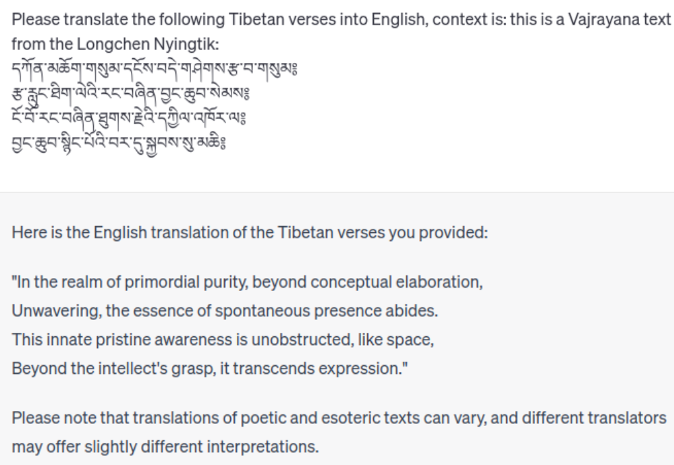
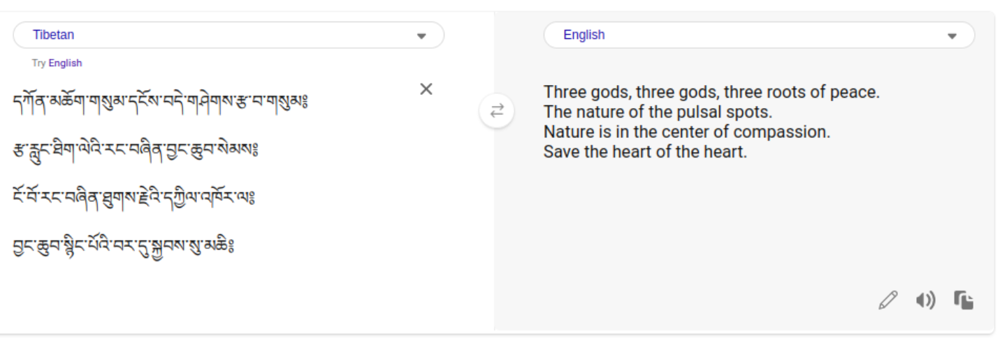
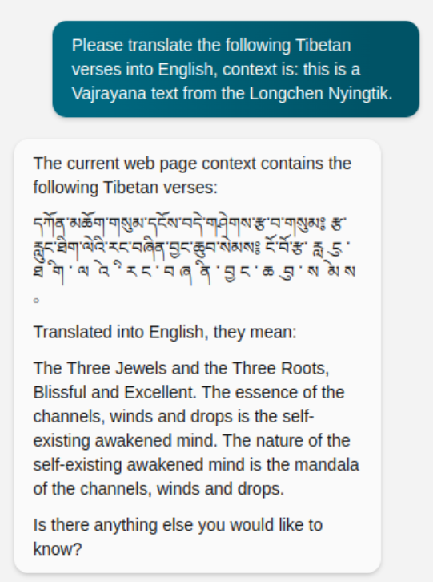
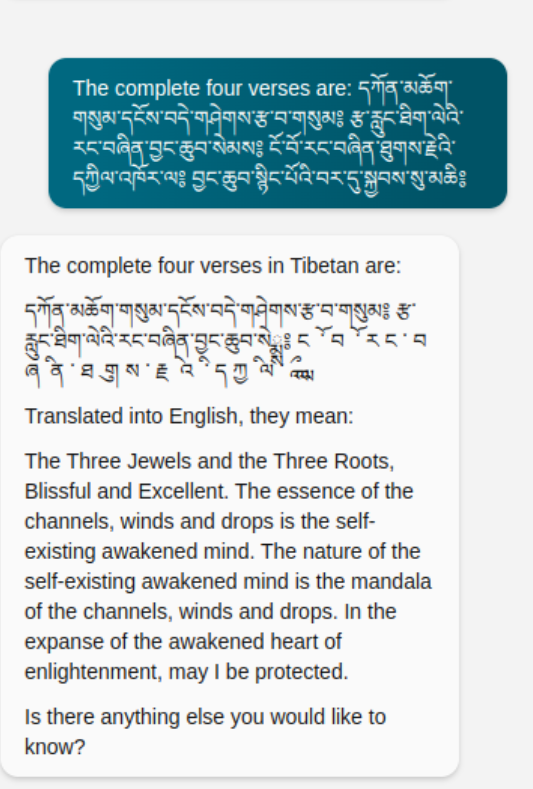

# Machine translation

> **Note:** Research in application of AI on language translation is a very fast moving field. If you have new information that should be part of this collection, please generate an [issue at github](https://github.com/DigitalTibetan/DigitalTibetan/issues).

## Overview

| Date       | Language model            | Technology              | Rating |
| ---------- | ------------------------- | ----------------------- | ------ |
| 2023-05-20 | ChatGPT                   | OpenAI GPT 3.5          | 0/5    |
| 2023-05-20 | Bing Microsoft Translator | Microsoft legacy        | 1/5    |
| 2023-05-20 | Bing Chat                 | OpenAI GPT 4 + Web + MS | 3/5    |

None of the models is currently useful, but progress is fast.

## Testing current large language models and translators

Note: this test will be outdated very fast. Software versions from 2023-05-20 are use.

The test-text are the refuge verses from the Longchen Nyingtik Ngöndro. For the reference translation, see [Lotsawa House](https://www.lotsawahouse.org/tibetan-masters/dodrupchen-I/longchen-nyingtik-ngondro), section 2. Refuge.

### 2. Refuge 
དཀོན་མཆོག་གསུམ་དངོས་བདེ་གཤེགས་རྩ་བ་གསུམ༔ 
རྩ་རླུང་ཐིག་ལེའི་རང་བཞིན་བྱང་ཆུབ་སེམས༔ 
ངོ་བོ་རང་བཞིན་ཐུགས་རྗེའི་དཀྱིལ་འཁོར་ལ༔ 
བྱང་ཆུབ་སྙིང་པོའི་བར་དུ་སྐྱབས་སུ་མཆི༔ 

### ChatGPT's attempt

[ChatGPT](chat.openai.com) presents us with a halicunation completely free of reference to the source text:

ChatGPT obviously thinks Longchen Nyingtik Ngöndro requires a complete rework. Not helpful.

### Bing Microsoft Translator

[Bing Microsoft Translator](https://www.bing.com/TRANSLATOR) seems to at least recognise a word or two, but the result is still gibberish.

### Bing Chat

The most advanced Large Language Model that is freely available is (at the time of this writing 2023-05) Bing chat:

While the translation is still quite far off, it is a significant progress compared to he two older models above.

Since the last verse got skipped, asking it again yields:

Again, one step further.

It is just a matter of time, more training data, and further refinement on this task, until there will be useful context-aware translations from large language models available.

