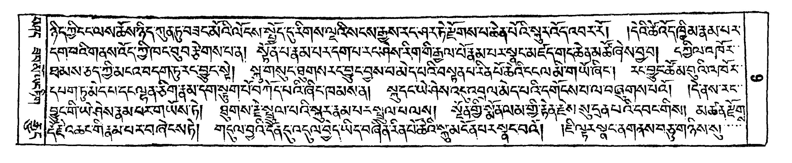

# Optical character recognition (OCR)

> **Note:** Research in application of AI on language translation is a very fast moving field. If you have new information that should be part of this collection, please generate an [issue at github](https://github.com/DigitalTibetan/DigitalTibetan/issues).

## Google drive and Google docs (online OCR)

Excellent progress has been made by Google in automatically converting woodblock pechas into editable text. This is currently the recommended way to OCR Tibetan text corpora.

The workflow for conversion is:

1. Get a Tibetan pecha or text in PDF format.
2. Upload the PDF file to Google drive (free Google account required)
3. Open the PDF with Google Docs: the PDF will be automatically translated to text, and color marking is used to highlight difficult parts.

### Example

A one-page PDF (you can also use of course multiple pages) is uploaded to Google Drive

The, in Google Drive, open the PDF. You will see a button "Open in Google Docs". Do so, you will get editable text:

Note that even the side-text and page-numbers have been automatically identified!

## Local conversion with Tesseract

