# History of Tibetan script

While Tibetan script is (remotely) related to Western Latin script via there common ancestor Proto-Sinaitic, the first alphabetic script, the Tibetan language is part of the Sino-Tibetan language family, without common ancestor with Indo-European or Afro-Asiatic languages. The following is a short overview of the relations between different scripts and languages:

## Script development

The following table compares five consonants in different scripts. With exception of Proto-Sinaitic, Gupta, and Nāgarī (which are images), correct display requires the corresponding Unicode fonts being installed. If fonts are missing (visible as a row in the table just being placeholder-boxes), it's easiest to install the [Noto family](https://fonts.google.com/noto) of fonts.

(tibetan_script_development)=
### Development of Tibetan script

This table shows the development of consonants `b`, `d`, `m`, `r`, and `t`:

| Script | b | d | m | r | t | Time period |
| :- | - | - | - | - | - | :- |
| [Hieroglyphic](https://en.wikipedia.org/wiki/Egyptian_hieroglyphs) | 𓉐  | 𓉿  | 𓈖  | 𓁶 | 𓏴 | c. 3200 BC - AD 400 |
| [Proto-Sinaitic](https://en.wikipedia.org/wiki/Proto-Sinaitic_script)[^proto_sinaitic] |  |  |  |  |  | 1900 BC - 1500 BC |
| [Phoenician](https://en.wikipedia.org/wiki/Phoenician_alphabet) | 𐤁 | 𐤃 | 𐤌 | 𐤓 | 𐤕 | 1050 BC - 150 BC |
| [Aramaic](https://en.wikipedia.org/wiki/Aramaic_alphabet) | 𐡁 | 𐡃 | 𐡌 | 𐡓 | 𐡕 | 800 BC - AD 600 |
| [Brāhmī](https://en.wikipedia.org/wiki/Brahmi_script) | 𑀩 | 𑀤 | 𑀫 | 𑀭 | 𑀢 | 300 BC - AD 500 |
| [Gupta](https://en.wikipedia.org/wiki/Gupta_script)[^gupta] |  |  |  |  |  | AD 400 - AD 600 |
| [Siddhaṃ](https://en.wikipedia.org/wiki/Siddha%E1%B9%83_script) | 𑖤 | 𑖟 | 𑖦 | 𑖨 | 𑖝 | AD 600 - AD 1200 |
| [Nāgarī](https://en.wikipedia.org/wiki/N%C4%81gar%C4%AB_script)[^nagari] |  |  |  |  |  | AD 100 (early), AD 700 - present
| [Devanagari](https://en.wikipedia.org/wiki/Devanagari) | ब | द | म | र | त | AD 100 (early) AD 700 - present |
| [Tibetan](https://en.wikipedia.org/wiki/Tibetan_script) | བ | ད | མ | ར | ཏ | AD 650 - present |

According to William Woodville Rockhill,[^nagari_origin] Tibetan was developed based on Nāgarī script: 

> The 7th century Tibetan king Songtsen Gampo ordered that all foreign books be transcribed into Tibetan language, and sent his ambassador Tonmi Sambota to India to acquire alphabet and writing methods, who returned with Sanskrit Nāgarī script from Kashmir corresponding to 24 Tibetan sounds and innovating new symbols for 6 local sounds. [_Wikipedia_](https://en.wikipedia.org/wiki/N%C4%81gar%C4%AB_script)

[^nagari_origin]: William Woodville Rockhill, [_Annual Report of the Board of Regents of the Smithsonian Institution_](https://books.google.com/books?id=avFDAQAAMAAJ&pg=PA671), p. 671, at Google Books, United States National Museum, page 671.


### Indus valley and Mesopotamia

| Script | b | d | m | r | t | Time period |
| :- | - | - | - | - | - | :- |
| [Indus valley script](https://en.wikipedia.org/wiki/Indus_script) |  |  |  |  |  | BC 3500 - BC 1900 |
| 


### For comparison: development of Latin script

The common ancestor of all alphabetic system based scripts is Proto-Sinaitic. Additionally, Old Italic was influenced by Phoenician:[^old_italic_phoenician]

> Proto-Sinaitic is considered the earliest trace of alphabetic writing and the common ancestor of both the Ancient South Arabian script and the Phoenician alphabet, which led to many modern alphabets including the Greek alphabet.[^proto_sinaitic_alphabet]

[^old_italic_phoenician]: The Old Italic alphabets clearly derive from the Phoenician alphabet, although the precise chain of cultural transmission is unknown. [(WP)](https://en.wikipedia.org/wiki/Old_Italic_scripts)
[^proto_sinaitic_alphabet]: See <https://en.wikipedia.org/wiki/Proto-Sinaitic_script>

| Script | b | d | m | r | t | Time period |
| :- | - | - | - | - | - | :- |
| [Hieroglyphic](https://en.wikipedia.org/wiki/Egyptian_hieroglyphs) | 𓉐  | 𓉿  | 𓈖  | 𓁶 | 𓏴 | c. 3200 BC - AD 400 |
| [Proto-Sinaitic](https://en.wikipedia.org/wiki/Proto-Sinaitic_script)[^proto_sinaitic] |  |  |  |  |  | 1900 BC - 1500 BC |
| [Phoenician](https://en.wikipedia.org/wiki/Phoenician_alphabet) | 𐤁 | 𐤃 | 𐤌 | 𐤓 | 𐤕 | 1050 BC - 150 BC |
| [Greek](https://en.wikipedia.org/wiki/Greek_alphabet) | Β | Δ | Μ | Ρ | Τ | 800 BC - present |
| [Old Italic](https://en.wikipedia.org/wiki/Old_Italic_scripts) | 𐌁 | 𐌃 | 𐌌 | 𐌓 | 𐌕 | 700 BC - 100 BC |
| [Latin](https://en.wikipedia.org/wiki/Latin_script) | B | D | M | R | T | 700 BC - present |
| [Runes](https://en.wikipedia.org/wiki/Runes) | ᛒ | ᛞ | ᛗ | ᚱ | ᛏ | AD 150 - AD 1100 |

[^proto_sinaitic]: Not yet (2022-05) part of Unicode, glyphs from: <https://omniglot.com/writing/protosinaitc.htm>. Unicode proposal for [proto sinaitic](https://www.unicode.org/L2/L2019/19299-revisiting-proto-sinaitic.pdf).
[^gupta]: Not yet (2022-05) part of Unicode, glyphs from: <https://en.wikipedia.org/wiki/Gupta_script> by: <https://commons.wikimedia.org/wiki/User:Mhss>
[^nagari]: Not part of Unicode, considered variant of Devanagari, glyphs from <https://en.wikipedia.org/wiki/N%C4%81gar%C4%AB_script> by: <https://commons.wikimedia.org/w/index.php?title=User:Benedettou&action=edit&redlink=1>


### Inter-relations

```mermaid
graph TD;  
BA(Megalithic graffiti symbols)-.->BB(Indus script 3500 BC - 1900 BC);

CA(Linear Elamite script 2300 BC - 1850 BC)-->CB(Cuneiform Elamite);
CB-->CD(Cuneiform Sumerian);
CD-->CE(Cuneiform Akkadian);
L0A(Egyptian Hieroglyphs 3200 BC - AD 400<br>)-->LA(Proto-Sinaitic script 1900 BC - 1500 BC);
LA-->LB(Phoenician alphabet 1050 BC - 150 BC);
LB-->LC(Aramaic alphabet 800 BC - AD 600);
LC-->LD(Brāhmī 300 BC - AD 500);
LD-->LE(Gupta);
LE-->LF(Siddhaṃ);
LF-->LG(Nāgarī);
LG-->LH(Devanagari);
LG-->LI;
LH-.->LI(Tibetan script);
LA-->LK(Greek alphabet 800 BC - present);
LK-->LL(Old Italic script 700 BC - 100 BC);
LL-->LM(Latin alphabet 700 BC - present);
LL-->LN(Runes AD 150 - AD 1100);
BB-.->LD;
BB-.->BA;
BB-.->CA;
LB-.->LL;
LE-.->LI;
BB-.->LA;
LA-.->BB;
```


Source: compiled from Wikipedia 2022-05

## Language development

```{mermaid}
graph TD;
AAA[Sino-Tibetan language family]-->AAB[Tibeto-Kanauri];
AAB-->AAC[Bodish];
AAC-->AAD[Tibetic];
AAD-->AAE[Old Tibetan];
AAE-->AAF[Tibetan];
AAA-->AAG[Sinitic];
AAG-->AAH[Chinese];
```

```{mermaid}
graph TD;
AA[Indo-European language family]-->AB[Indo-Iranian];
AB-->AC[Indo-Aryan];
AC-->AD[Sanskrit];
AA-->ABA[Germanic];
ABA-->ABB[West Germanic];
ABB-->ABC[High German];
ABC-->ABD[German];
ABB--> ABBA[North Sea Germanic];
ABBA-->ABBB[Anglo-Frisian];
ABBB-->ABBC[Anglic];
ABBC-->ABBD[English];
AA-->ACA[Italo-Celtic?];
ACA-->ACB[Italic];
ACB-->ACC[Romance];
ACC-->ACD[Western Romance];
ACD-->ACE[Gallo-Romance];
ACE-->ACF[Oïl];
ACF-->ACG[French];
```

```{mermaid}
graph TD;  
AH[Afro-Asiatic language family]-->AI[Semitic];
AI-->AJ[East Semitic];
AJ-->AK[Akkadian];
BE[Sumerian language isolate]<-.->AK;
AI-->AM[Central Semitic];
AM-->AN[Northwest Semitic];
AN-->AO[Aramaic];
AO-->AP[Eastern Aramaic];
AP-->AQ[Northeastern Neo-Aramaic];
AQ-->AR[Assurian];
```
Sources: compiled from Wikipedia 2022-05
